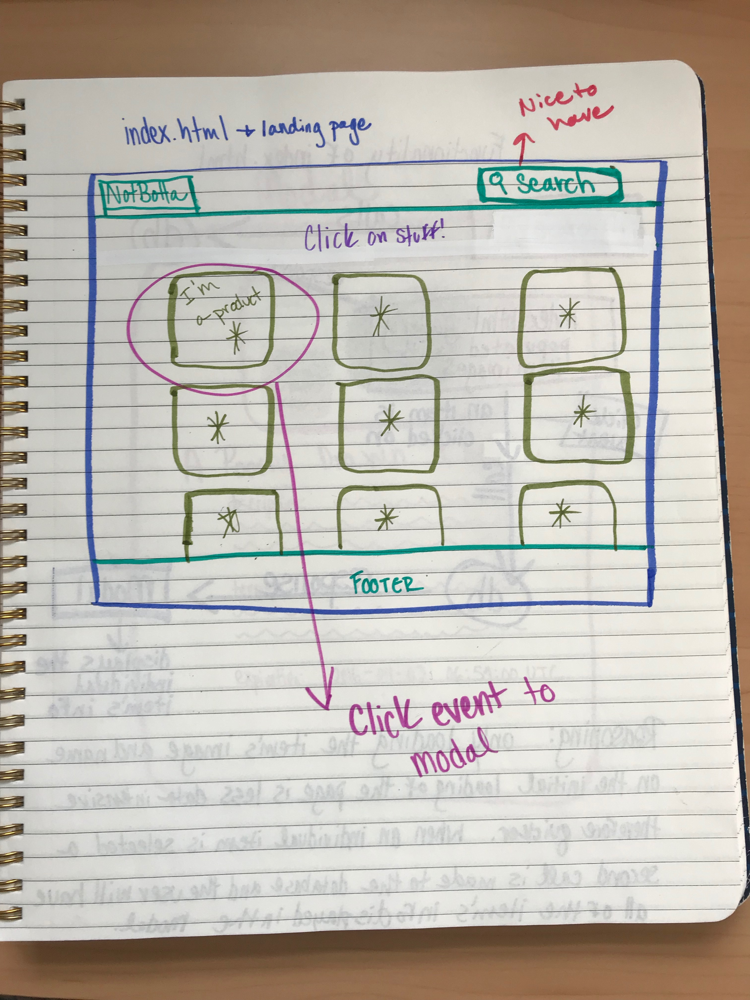
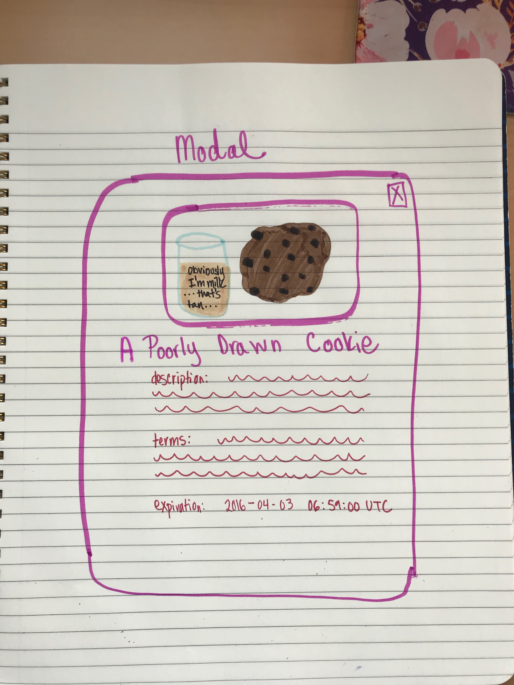
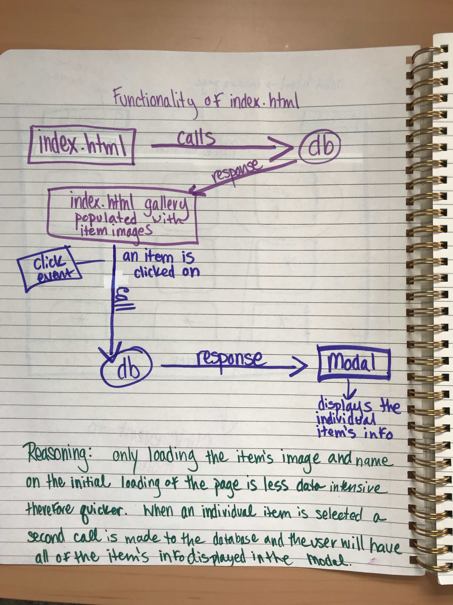

# Not Botta Pivot!

Welcome to my Ibotta coding challenge!  

Landing page wireframe:

Modal wireframe:

Workflow:

### My First Attempt
In my first attempt I used a MySQL database and a node server.  I tried using browserify to keep my node server but I was unsuccessful. After struggling to get my frontend and backend JavaScript to communicate I decided to switch to an express server so that I would have access to res.json, res.send, and other response methods to get the two ends talking.  My end goal was to get each product's name and image to the browser.  When an image was clicked on a modal would pop up with the product's name, image, description, terms, and offer expiration date.  My nice-to-have was a search bar.

### The Pivot
I was able to get data from the database but ultimately I was unable to get the data to the front so I abandoned the database and server in favor of an array of product objects so that I could have something that mimicked the original functionality I attempted.    

### The Final App
Using dummy data I replicated the functionality I intended originally.  When a user comes to this site they will view 16 products in the gallery.  When the user clicks on an image they are taken to a modal that has the name of the product, its image, description, terms, and expiration date.  The user can exit the modal and will be back at the gallery to select another item.  I changed the cursor to a pointer when hovering over the images in the gallery.

### What I Learned
I learned how to modal!  This was something that I've struggled with in the past, but lots and lots of Stack Overflow got me there in the end!  

### What I Would Do Differently
If I were to redo this project I would use Handlebars instead of node to get my data through, I ran out of time because I spent too much of it trying to get node to work instead of moving along.

### Further Development
* Get the backend JS to play nicely with the frontend so that I can remove the dummy data!  
* Wire up the search bar.
* Add sorting functionality (sort data by expiration data, item type, etc.).

## Developed by
### Katie Burrows 

